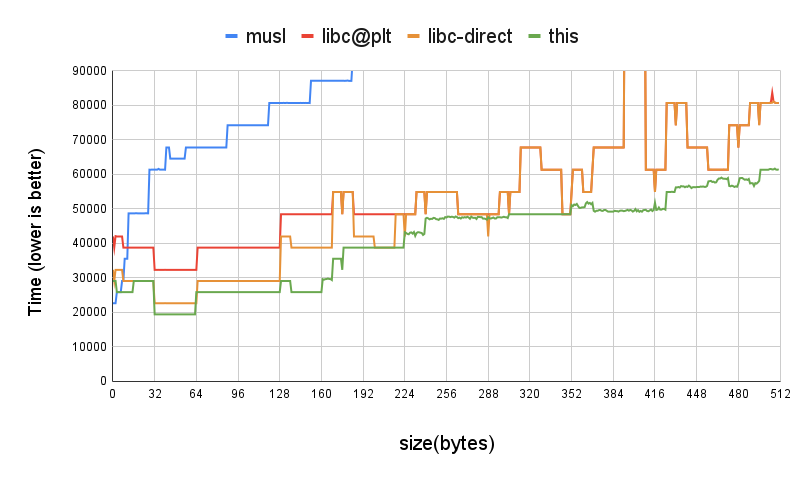
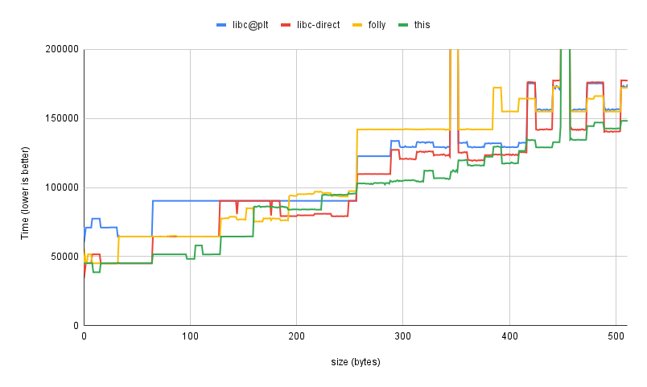
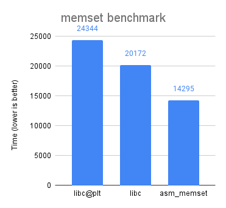
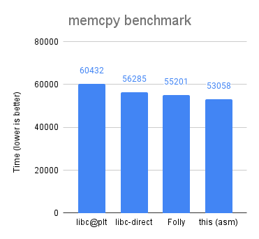

# Fast Memset and Memcpy implementations

This repository contains high-performance implementations of memset and memcpy
for x86. These implementations outperform the folly and glibc implementations.
This repository contains several reference implementations in C and assembly.

Before reading the source code in this repository you probably want to read an
excellent blog [post](https://msrc-blog.microsoft.com/2021/01/11/building-faster-amd64-memset-routines/)
by Joe Bialek.

The charts below compare the implementations in this repo with other
implementations: folly, musl, and glibc.  The glibc implementations are measured
with and without the elf indirection, as suggested by Dave Zarzycki).

## Memset


## Memcpy


The chart below compares the performance of different memset implementations on
buffers of varying sizes and offsets. Unlike the hot loop that hammers a single
value, this benchmark is more realistic and takes into account mispredicted
branches and the performance of the cpu decoder. The buffers are in the size
range 0 to 256. The random function is made of pre-computed random values, to
lower the overhead of the random function.  This was suggested by Yann Collet.
The 'nop' function is used to compute the benchmark setup overhead and call
overhead, and the nop-cost is subtracted from all figures.

 

The size of the buffer that memset and memcpy mutates is typically small. The
picture below presents the buffer length distribution in google-chrome. Vim,
Python, and even server workloads have a similar distribution. The values in the
chart represent the power of two buffer size (10 represents the values between
512 and 1024).
 


The repository contains a few utilities for testing and measuring the
performance and correctness of memset and memcpy.

## Test tool

This is a small test harness that verifies the correctness of the
implementations. It's really easy to make mistakes with off-by-one errors and
run into alignment issues. The exhaustive tester catches these issues.

This is a sample output:
```
OOOOOOOOOOOXX
           ^
Filling a buffer of length 13. Expected "O" at index 11
```

## Benchmark tool

The benchmark tool measures the performance of the system libc and the local
implementation. The benchmarking tool runs each of the implementations in a loop
millions of times. It runs the benchmark several times and picks the least noisy
results. It's a good idea to run the benchmark tool and compare some
implementation to itself to assess the noise level in the system. The
benchmarking tool uses a trampoline to prevent the compiler from inlining and
expanding the memset.

## Histogram tool

The histogram tool is a shared object that collects records calls to memset and
memcpy and creates a histogram of the length parameter. It prints the histogram
when the program exits cleanly. The shared object can be loaded using
LD\_PRELOAD (on Linux) or DYLD\_INSERT\_LIBRARIES (on Mac). Each bucket in the
output represents the log2 size of the buffer, and each value represents the
number of hits for the bucket.

## Proxy tool

This is a small utility that swaps the builtin call to memset and memcpy with
the local implementation from this project. The shared object can be loaded
using LD\_PRELOAD (on Linux) or DYLD\_INSERT\_LIBRARIES (on Mac).

